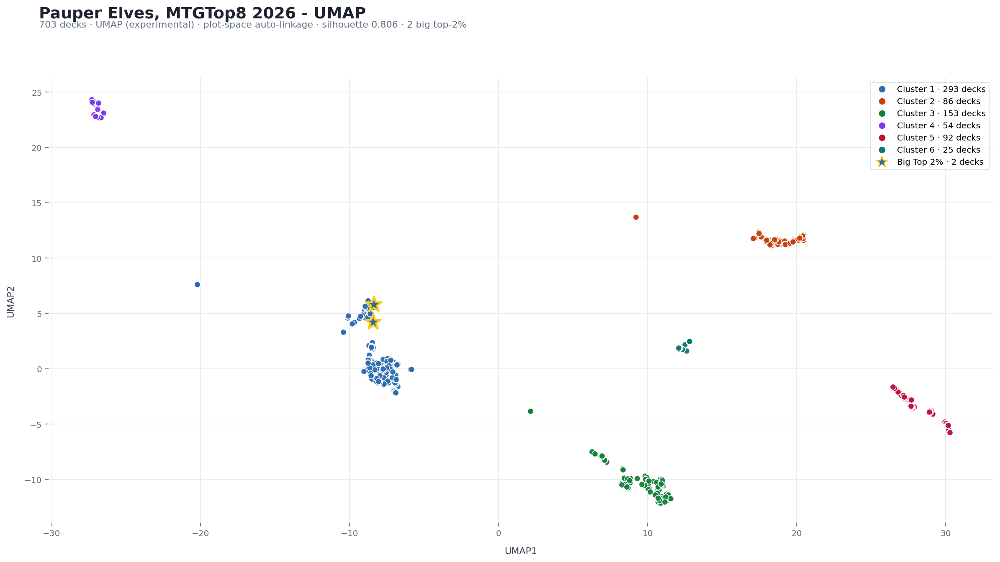

# MTGTop8 Deck Explorer

Local-first deck similarity plots for MTGTop8 search results.

This is an unofficial fan tool for exploring Magic decklists. It recreates the MTGTop8 search sidebar, fetches matching decklists, projects them into a 2D similarity plot, and lets you inspect clusters as rough deck archetypes.



## What It Does

- Searches MTGTop8 by format, archetype, event, player, deck name, cards, date range, and event source.
- Filters events by `Both`, `Paper`, or `Online`.
- Fetches MTGTop8 compare pages in batches and caches them locally.
- Projects decklists with UMAP, PCoA, or PCA.
- Clusters decks with auto hierarchical clustering, HDBSCAN, or fixed K.
- Supports card equivalency classes such as `Dorks: Llanowar Elves, Fyndhorn Elves, Elvish Mystic`.
- Treats snow basics as normal basics by default.
- Shows Scryfall mana costs and card-image previews in deck/cluster inspectors.

## Quick Start

Create a virtual environment, install dependencies, and run the local server:

```bash
python3 -m venv .venv
source .venv/bin/activate
pip install -r requirements.txt
python app.py --open
```

If `8765` is already busy:

```bash
python app.py --port 8766 --open
```

Then open the printed local URL, usually:

```text
http://127.0.0.1:8765/
```

The older positional form still works:

```bash
python app.py 8765
```

## Using It

Start with `Basic Settings`.

- `Format` defaults to Pauper.
- `From` defaults to `2026-01-01`; `To` defaults to today.
- `Source` can limit the result set to paper or online events.
- `Cards` searches for decks containing one or more card names.
- `Main deck` and `Sideboard` control where MTGTop8 searches for those cards.
- `Scope` controls which card rows are used for the similarity model.

Use `Card Equivalency` when cards should be treated as the same feature:

```text
Dorks: Llanowar Elves, Fyndhorn Elves, Elvish Mystic
Basics: Forest, Snow-Covered Forest
Helix: Retraction Helix, Banishing Knack
```

Use `Nerd Stuff` to change projection, weighting, clustering, and outlier behavior. The defaults are meant to be reasonable for exploratory use.

## Caching And Courtesy

The app stores fetched data in `.cache/cache.sqlite3`.

- MTGTop8 search pages are cached for a week.
- MTGTop8 compare pages are cached indefinitely.
- Scryfall card metadata is cached for 90 days.

This cache is intentional: it keeps the app responsive and avoids repeatedly hitting MTGTop8 for the same searches. Prefer narrowing huge searches with format, date, source, card, or archetype filters.

To clear all local cached data:

```bash
rm -rf .cache
```

The next run will recreate the cache.

## Limits

Some methods need an all-deck-by-all-deck distance matrix. Those are capped at 3,000 decks locally. For larger searches, use UMAP/PCA with plot-space clustering or narrow the search.

Online/paper classification is based on MTGTop8 event text. It catches obvious online events such as MTGO, Magic Online, Online, Play Point, Fuguete, Royale, Empanadillahumana, DPL Online, and Tropical. If you spot a misclassified event, add another keyword to `ONLINE_EVENT_KEYWORDS` in `app.py`.

## Development

Run the app:

```bash
python app.py --open
```

Basic checks:

```bash
python3 -m py_compile app.py
node --check static/app.js
git diff --check
```

Project layout:

```text
app.py              Python server, MTGTop8/Scryfall fetching, analysis pipeline
static/index.html   App shell
static/app.js       Frontend interactions and SVG plot rendering
static/styles.css   Styling
requirements.txt    Python dependencies
screenshots/        Example screenshots for docs
```

## Distribution Ideas

The safest first public shape is local-first:

- GitHub repo with this README.
- `python app.py --open` for people comfortable with Python.
- A future PyInstaller or similar desktop bundle for people who just want to double-click.
- Optional Docker image for self-hosting.

A hosted demo is possible, but it should probably use precomputed datasets or strict rate limits. Running arbitrary public MTGTop8 searches from one shared server could create too much load and make you responsible for the scraping/computation bottleneck.

## Notes

This project is not affiliated with MTGTop8, Scryfall, Wizards of the Coast, or Hasbro. Card images and card data come from Scryfall. Tournament/deck data comes from MTGTop8.

MIT licensed. See `LICENSE`.
